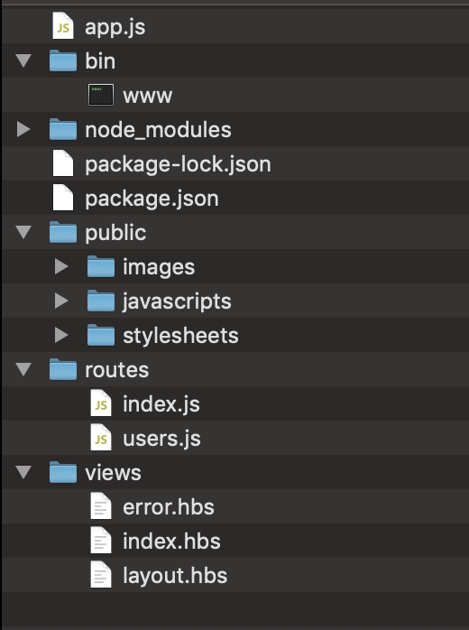

# Web aplications

## Requisites
- Install [nodeJs](https://nodejs.org/en/download/)
- Install [expressJs](https://expressjs.com/en/starter/installing.html)  
- Install express-generator `$ npm install -g express-generator`
- Install [MongoDB](https://docs.mongodb.com/manual/administration/install-community/)
- Install mongoosejs `$ npm install mongoose`

---

---

- Mongoose: Mongoose is an object data modeling (ODM) library that provides a rigorous modeling environment for your data, enforcing structure as needed while still maintaining the flexibility that makes MongoDB powerful

---

- We will use express generator to quickly create an application skeleton.  
`$ express --hbs myApp`  
`$ cd myApp`  
`$ npm install`  

- The result directory

.

---

Let's see each folder

- bin/ directory serves as a location where you can define your various startup scripts. The www is an example to start the express app as a web server. Ultimately, you could have different scripts like test, stop, or restart, etc. Having this structure allows you to have different startup configurations, without cramming everything into app.js.

- node_modules/ 
Module in Node. js is a simple or complex functionality organized in single or multiple JavaScript files which can be reused throughout the Node. js application. Each module in Node. js has its own context, so it cannot interfere with other modules or pollute global scope.

- package.json 
All NPM (Node Package Manager) packages contain a file, usually in the project root, called package.json file. package.json contains all the information of your web app.It contains all the metadata{set of data which describes and gives info about all other data}.

- package-lock.json
It stores an exact, versioned dependency tree rather than using starred versioning like package.json itself (e.g. 1.0.*). This means you can guarantee the dependencies for other developers or prod releases, etc. It also has a mechanism to lock the tree but generally will regenerate if package.json changes.

- public 
(static files) We’re going to make everything in the public directory available for viewing. This means that we should not put anything secret/sensitive in there, so keep any files with passwords, tokens, etc. out of the public folder, or users will be able to see it.

---

## Task
CRUD API for _________ (example, restaurant menu)
CRUD = Create, Read, Update, Delete

---

## Procedure

- First we get all the dependencies whe need.  
    `var mongoose = require('mongoose');` For database.
    `var exphbs = require('express-handlebars');` For view engine

- Now, we create the model of our entities. In this example, we have 2.
    - Dishes.
    - Categories.

- Next, we create the data controllers. Controllers/**

- First we create the views. We have 2 views.
    - Create/Update new dish.
    - See all menu.
    
